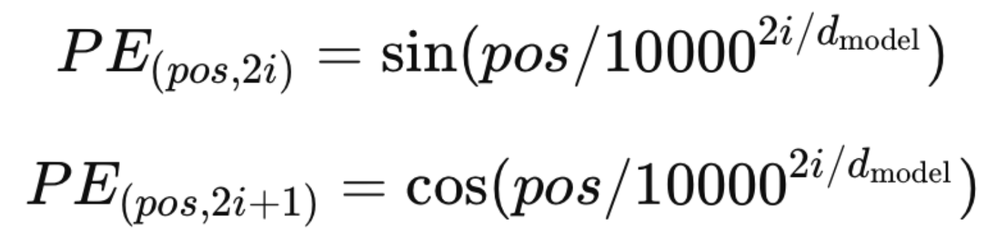
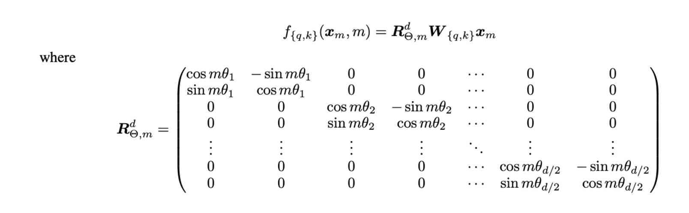
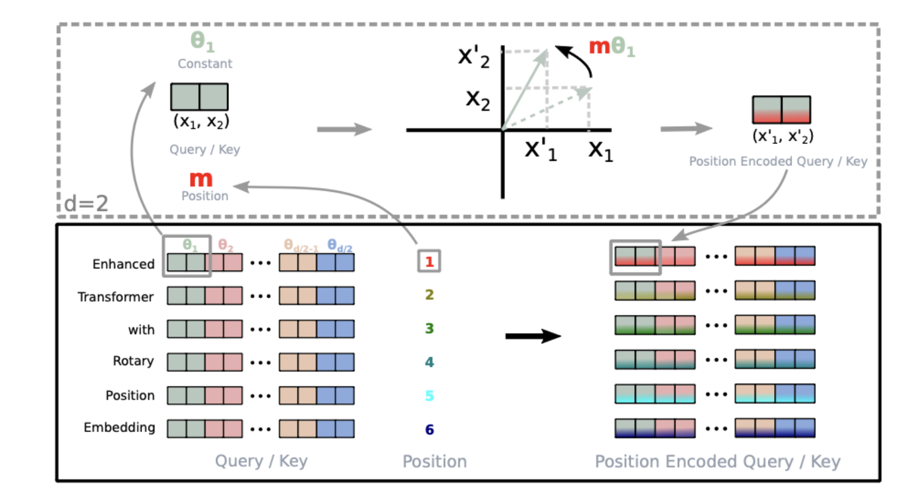

# Roformer-overview

**Author: Xuhui Zhan**

**Email: xuhui.zhan@vanderbilt.edu**

## Overview of RoFormer

- **Context and Problem**: Traditional transformer models leverage position embeddings to understand the sequence's structure and the relationships between elements at different positions. The challenge is effectively incorporating both absolute and relative position information into the self-attention mechanism to enhance the model's understanding of sequence dependencies.

**What are the existed approaches before Roformer?**

### Absolute Positional Encoding

- **Concept**: The idea behind absolute positional encoding is to provide the model with information about the position of tokens in the sequence. This is crucial since the self-attention mechanism in transformers is inherently permutation-invariant, meaning it doesn't consider the order of tokens unless provided with positional information.
- **Implementation**: Absolute positional encodings are **added** to the input embeddings before they are fed into the transformer layers. These encodings have the same dimension as the token embeddings so that the two can be summed directly. The positional encoding for each position in the sequence is calculated independently and is the same across different sequences of the same length.
- **Sinusoidal Encoding**: Vaswani et al. proposed using sinusoidal functions to generate positional encodings. For each dimension of the positional encoding, sine and cosine functions of different frequencies are used:
- **Advantages**: This method is straightforward and was shown to be effective in allowing the model to use the order of the sequence. The use of sinusoidal functions also means that the model can extrapolate to sequence lengths greater than those seen during training.
- **Limitations**: Despite its effectiveness, absolute positional encoding has limitations. It does not dynamically adjust based on the context of tokens and treats each position in isolation. This can be a drawback for capturing more complex positional relationships or when **dealing with very long sequences where relative positioning might be more informative than absolute positioning**.

### Trainable Positional Embeddings

- **Concept**: Trainable positional embeddings introduce a learning-based approach to encode the position of tokens within a sequence for transformer models. Unlike fixed strategies that use pre-defined formulas, trainable embeddings adjust during the training process, allowing the model to tailor positional information to the specifics of the task. This adaptability is crucial for capturing nuanced positional dependencies that fixed methods might overlook.
- **Implementation**: In practice, trainable positional embeddings are implemented as a matrix of parameters that are learned alongside the model's other weights. For each position in the sequence, there is a corresponding embedding in this matrix. These embeddings are **added** directly to the token embeddings before processing by the transformer's layers, ensuring that each token is represented by a combination of its semantic content and its learned positional context.
- **Learning Dynamics**: The positional embedding matrix is initialized randomly and updated through backpropagation as part of the model's training process. This enables the embeddings to evolve in ways that are optimally informative for the model's specific tasks, potentially leading to more effective processing of sequence data.
- **Advantages**: One of the main advantages of trainable positional embeddings is their ability to adapt to the dataset and task at hand. Because these embeddings are learned, they can capture complex, task-specific patterns in positional information that might be missed by fixed encodings.
- **Limitations**: A notable limitation of trainable positional embeddings is their potential difficulty in generalizing to sequence lengths that are significantly different from those encountered during training. Since the embeddings for each position are explicitly learned, the model may not inherently understand how to extrapolate positional information for positions it has not seen.

### RoFormer's Approach

RoFormer's key innovation is the introduction of Rotary Position Embeddings (RoPE), which encode both absolute and relative position information directly into the token embeddings through a rotation mechanism. Unlike traditional methods that add positional information as separate embeddings, RoPE integrates this information by mathematically rotating the embeddings based on their sequence positions. This rotation is designed to alter the embedding space in a way that the attention mechanism's dot product calculations between tokens inherently reflect their relative distances.

### How RoFormer Addresses the Problem

1. **Rotary Embeddings**: RoFormer calculates a unique rotation for each token based on its position in the sequence. This is done using a rotation matrix that systematically alters the token's embedding, embedding positional information directly into the vector space of the embeddings.
2. **Attention Mechanism Enhancement**: By rotating embeddings, the dot product used in the self-attention mechanism becomes sensitive not just to the similarity of tokens, but also to their positions relative to each other. This allows the model to more effectively weigh the importance of different tokens based on how far apart they are in the sequence, enhancing its ability to capture long-range dependencies.

## Key Features of RoPE

- **Encoding Method**: RoPE uses a **rotation matrix** to encode absolute positions and incorporates explicit relative position dependency into the self-attention mechanism.
- **Advantages**:
  - Flexibility with sequence lengths, allowing effective handling of variable-length sequences.
  - Decaying inter-token dependency with increasing relative distances, reflecting the intuition that tokens further apart should have a lesser connection.
  - Capability to equip linear self-attention with relative position encoding, enhancing efficiency and interpretability.

### Implementation of RoPE:

**Let' s start from 2D:**

Given a token embedding vector:

$$
x\in \mathbb R^d
$$

where d is the dimensionality of the embeddings, and a position p*p* for this token in the sequence, the rotated embedding x′ can be calculated using a rotation matrix **R(p) * x** . The formula for the rotation in a 2D plane, which can be extended to high dimensions, is shown below. In practice, RoPE operates in a higher-dimensional space, applying a rotation to each pair of dimensions in the embedding vector.

For simplicity, let's consider a 2D rotation. The rotation of a point **(x1,x2)** in a 2D plane by an angle θ is given by:

$$
x' = R(\theta)x
$$

And ***R*(θ)** is the 2D rotation matrix:

$$
R(\theta) = \begin{bmatrix}
\cos(\theta) & -\sin(\theta) \\
\sin(\theta) & \cos(\theta)
\end{bmatrix}
$$

In the context of RoPE, θ would be derived from the position p*p* of the token in the sequence, potentially using a function that maps positions to angles. For higher-dimensional embeddings, rotations are applied in a similar manner to each pair of dimensions, effectively treating the high-dimensional space as composed of multiple 2D planes.

The actual implementation of RoPE for a sequence of tokens involves applying such rotations to all dimensions of all token embeddings, where the rotation angles or parameters are determined based on the positions of the tokens in the sequence. This can be generalized to d*d* dimensions (where d*d* is even) by applying the rotation to pairs of dimensions (2i,2i+1) for i=0,1,…,d / 2−1, with possibly **different rotation angles for each pair of dimensions**.

**How to calculate θ**:

$$
\theta_{p, i} = \omega_i  p
$$

where:

- **p** is the position index in the sequence,
- **i** is  the dimension for which we're calculating the angle,
- **ωi** is a frequency parameter that varies with dimension i*i*.

The frequency parameter **ωi** is often chosen to vary geometrically across the dimensions, allowing the model to capture a wide range of frequencies and thus a wide range of positional relationships. For example, **ωi** could be defined as:

$$
\omega_i = 1/ 10000^{2i/d}
$$

#### General form for rotary matrix:

### Illustration of Roformer implemenation:

**What about the relative positional encoding?**

### Illustration of influence of RoPE in attention mechanism

To illustrate how attention computation with Rotary Position Embeddings (RoPE) makes the dot product influenced by relative positions, let's consider an extreme example with a simplified setup. Assume we have a sequence of two tokens, A and B, with their respective embeddings **xA** and **xB**, and we want to compute the attention that A pays to B.

In a traditional attention mechanism without positional encoding, the relevance (attention weight) between two tokens is computed based on the dot product of their embeddings. If **xA** and **xB** are similar, the dot product **xA⋅xB** will be high, indicating high relevance.

Now, let's introduce RoPE and see how it changes the scenario:

1. **Without Rotation (Traditional Attention)**: Assume **xA** and **xB** are identical (for simplicity, let's say both are **[1, 0]** in a 2D embedding space). The dot product without rotation is **xA⋅xB=1**, indicating **high similarity or relevance.**
2. **With Rotation (RoPE)**: RoPE introduces a rotation based on the position of each token. Let's say the rotation angle for position 1 (token A) is 0 degrees (no rotation), and for position 2 (token B), it's 90 degrees for the sake of an extreme example.

   The rotation matrix for a 90 degrees rotation in 2D is:

   $$
   R(90^\circ) = \begin{pmatrix}
   0 & -1 \\
   1 & 0
   \end{pmatrix}
   $$

   Applying this rotation to xB yields **R(90∘)⋅xB=[0,1]**.
3. **Dot Product with RoPE**: The dot product between **xA** and the **rotated *x*B** is now:

   $$
   x_A \cdot (R(90^\circ) \cdot x_B) = [1, 0] \cdot \begin{pmatrix} 0 \\ 1 \end{pmatrix} = 0
   $$

   With RoPE, despite **xA** and **xB** being identical initially, the rotation makes their dot product  as **0**, indicating that the model perceives them as unrelated or independent in their transformed (rotated) space, purely due to their relative positions.

### Pseudocode for Roformer:

Check the file **"pseudocode_for_roformer.pdf"** in the repo.

## Performance and Applications

- **Benchmark Performance**: RoFormer has shown to outperform traditional transformer models on long text classification tasks, demonstrating its effectiveness in leveraging positional information.
- **Theoretical Support**: The model is backed by a theoretical analysis explaining its experimental results, providing a solid foundation for its approach.

## Critical Thinking

- Unmentioned about the learnable positional embedding matrix, are they completed abandoned?
- Is it possible to apply rotation matrix on positional embedding? (As a combination of both)
- Is it possible to use other number or function when calculating the frequency?

## Integration and Accessibility

- **Huggingface Integration**: RoFormer is integrated into the Huggingface Transformers library, making it easily accessible for researchers and practitioners to use in various NLP tasks.
- **Code demonstration**: See details in the file **"code_demostration.ipynb"** in the repo.

## Citation

Su, J., Lu, Y., Pan, S., Murtadha, A., Wen, B., & Liu, Y. (2021). RoFormer: Enhanced Transformer with Rotary Position Embedding. *arXiv preprint arXiv:2104.09864v5*. https://doi.org/10.48550/arXiv.2104.09864

## Useful links

Original transformer with absolute position encoding (Attention is all you need): https://arxiv.org/abs/1706.03762

Roformer paper on arXiv: https://arxiv.org/abs/2104.09864

Roformer GitHub repo: https://github.com/ZhuiyiTechnology/roformer

Zhuiyi website: https://zhuiyi.ai

Roformer on hugging face documentation: https://huggingface.co/docs/transformers/model_doc/roformer#roformer
